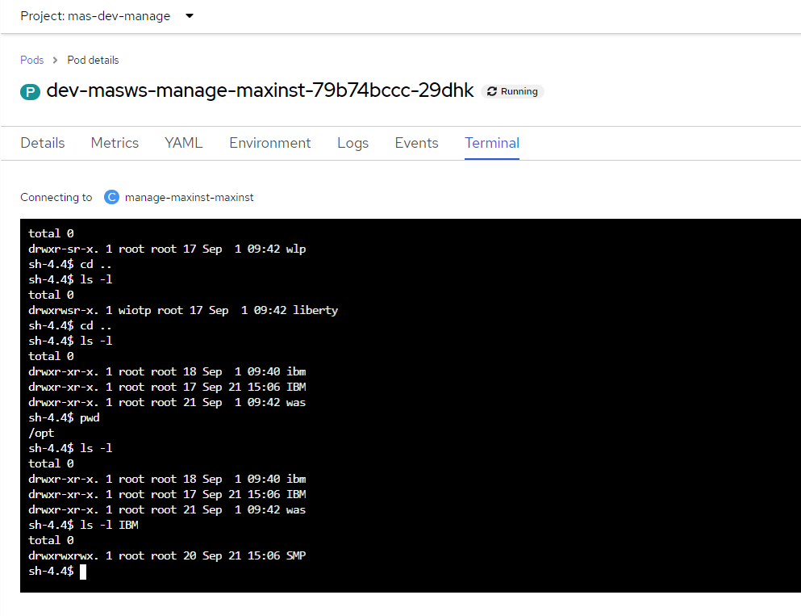

# Access to DB2 and Liberty pods in Maximo installation

Documentation link

- https://www.ibm.com/docs/en/cloud-paks/cp-data/4.8.x?topic=connecting-configuring-tls-client-connections

You need to find the TLS NodePort on your cluster that is used by the Db2 database.
OpenShift®
```
oc -n ${PROJECT_CPD_INST_OPERANDS} get svc | grep db2u-engn-svc
```
Consider the following example output:
```
mpp2-db2u-engn-svc    NodePort    10.0.86.99     <none>        50000:32209/TCP,50001:31050/TCP      20h
```

Configure your database client application to use that NodePort value when it connects to the database with the installed TLS certificate.
Using the previous example, you would configure your client application to use 10.0.86.99 as the IP address and port 31050 to connect to the Db2 database server that is running on the Cloud Pak for Data cluster.

- https://console-openshift-console.apps.xxx/k8s/ns/mas-dev-core/secrets/jdbc-db2w-shared-credentials

xxx = your cluster domain


To get password/username click on Reveal values right to fields


#### Service detail in Maximo installation


### DBeaver connection


## Maximo Application Suite pod details

- https://www.ibm.com/docs/en/mas-cd/continuous-delivery?topic=reference-maximo-application-suite-pod-details

{instance_name}-{workspace_name}-manage-maxinst
The Manage admin server, which is used for administrative tasks such as running the maxinst/updated B and installing languages. Contains the full SMP folder, which provides access to all binary files, dbc files, and admin tools utilities.
For more information, see Administrative tasks for Maximo Application Suite.



### How to use the Tools API with Maximo Manage

- https://www.ibm.com/support/pages/how-use-tools-api-maximo-manage

### Backup links

- https://www.linkedin.com/pulse/running-maximo-manage-stand-alone-openshift-server-red-nishimura/
- https://github.com/ibm-mas/mas-performance/blob/master/docs/mas/manage/bestpractice.md

